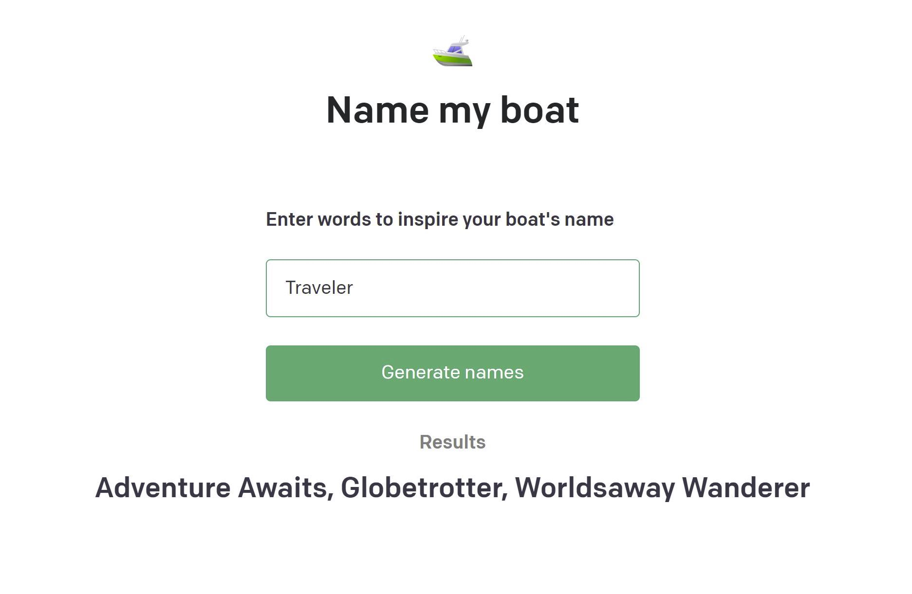

# Name My Boat
[](/LICENSE)

Uses Text-Davinci-003 ([an OpenAI GPT-3.5 model](https://platform.openai.com/docs/models/gpt-3-5)) to suggest names for a boat based on user input. User provides a word or words which provides an overall theme for the AI to suggest names. 

This project uses [OpenAI's API Quickstart project](https://github.com/openai/openai-quickstart-node) for Node.js. 

Deployed to Vercel: 
https://openai-text-davinci-003.vercel.app/



- [Name My Boat](#name-my-boat)
  - [Getting Started ](#getting-started-)
  - [Start the Application  ](#start-the-application--)
  - [Technologies Used  ](#technologies-used--)
  - [Contributing ](#contributing-)
  - [Github Link  ](#github-link--)

---

##  Getting Started <a name = "environment_setup"></a>

  To run this application in your own development environment, install [NodeJs](https://nodejs.org/). This repository was developed using [Visual Studio Code](https://code.visualstudio.com/).
  
  You will need to create an OpenAI account and [create your own API key](https://platform.openai.com/account/api-keys)

----
## Start the Application  <a name = "start"></a>

 Install all node package dependencies listed in the package.json file using the following command in your terminal, in the directory of the project:

```
npm install
```

After all packages have been installed, you can run a development version of the application in your web browser on localhost using this command:

```
npm run dev
```

##  Technologies Used  <a name = "tech_stack"></a>
- [NodeJS](https://nodejs.org/) -  JavaScript runtime
- [ReactJS](https://reactjs.org/) - JavaScript UI library
- [Next.js](https://nextjs.org/) - Promise based HTTP client

----------------
##  Contributing <a name = "contributing"></a>

Open source contributions are always welcome. Submit a pull request or an issue if you would like to contribute or request improvements.


<br/>


----------- 
## Github Link <a name = "#github_link"> </a>
[ https://github.com/alane019/OpenAI-Nodejs ](https://github.com/alane019/OpenAI-Nodejs)


--------------
